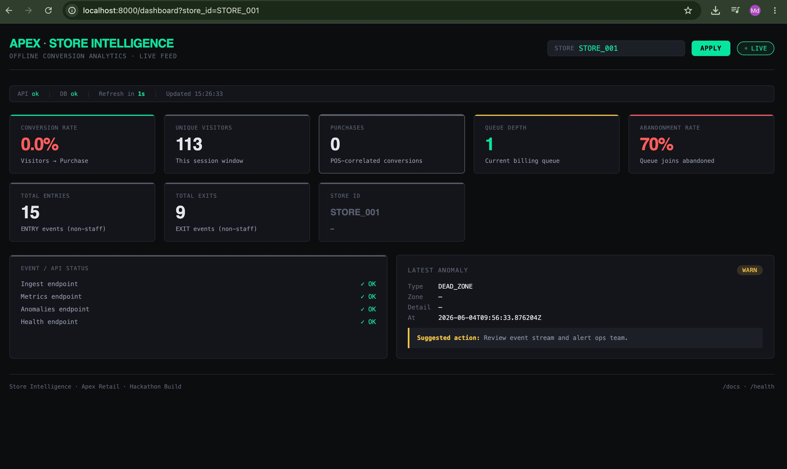
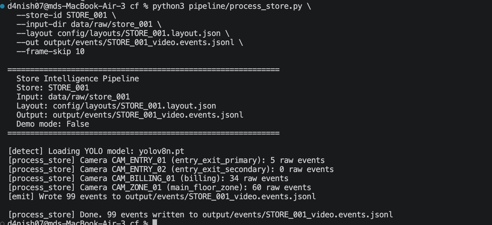
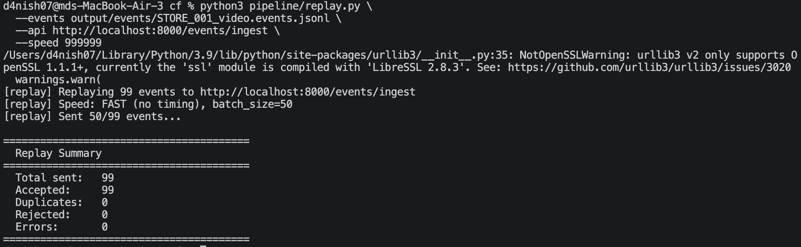
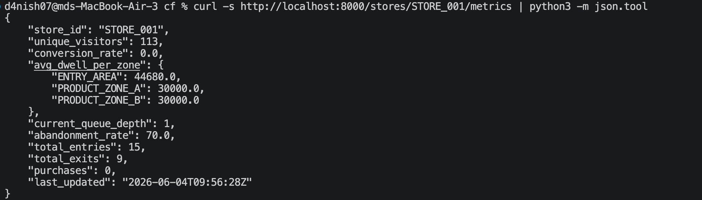
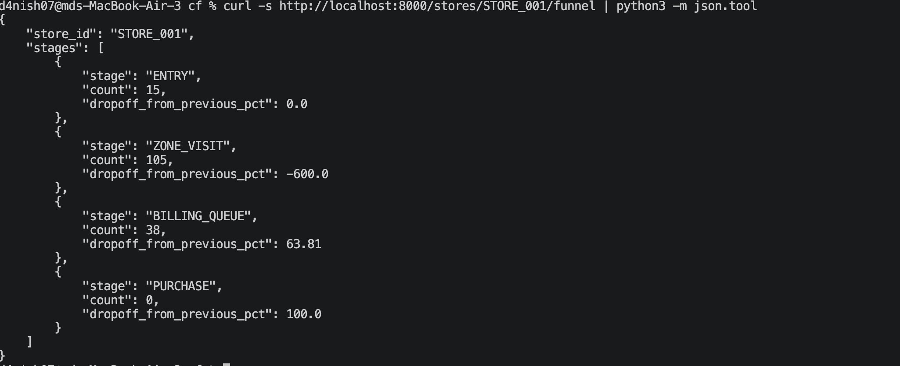
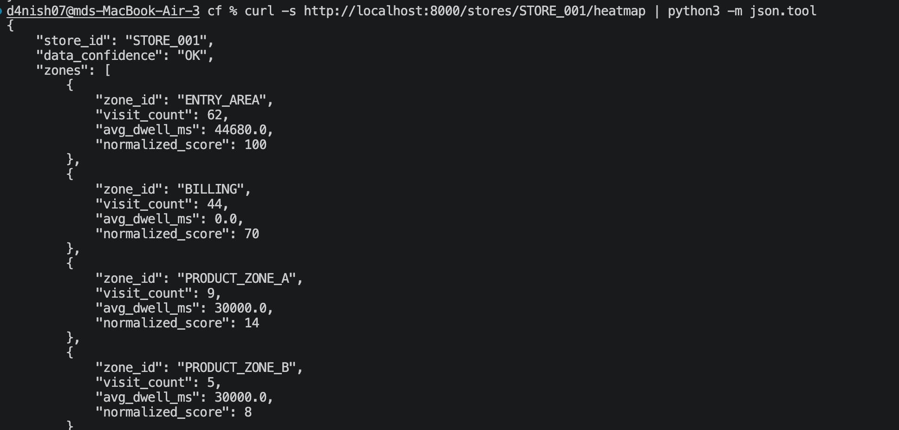
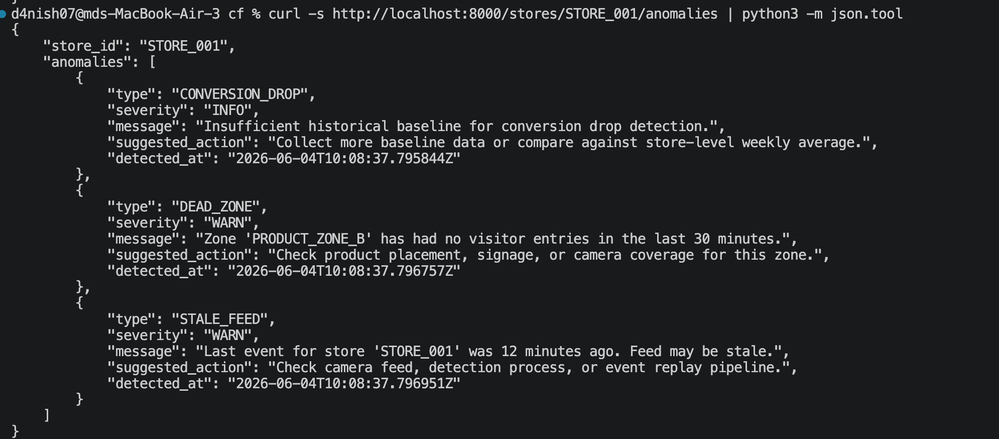
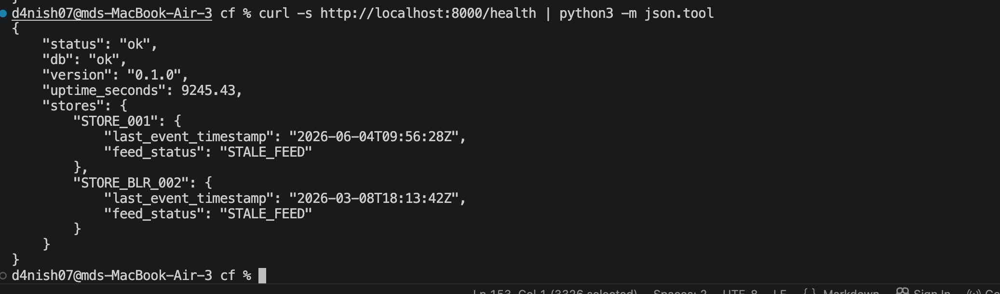
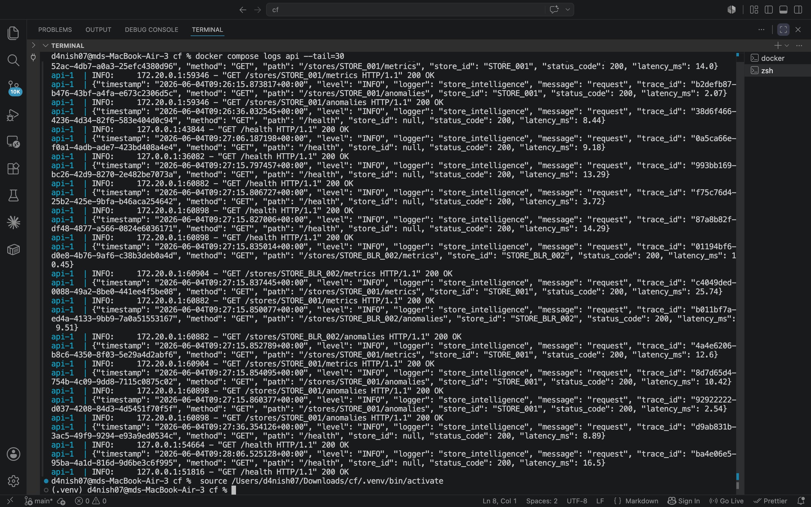

# Screenshots — Store Intelligence System

> **All screenshots below were captured from a live running instance** of the Store Intelligence system on 2026-06-04. The full stack was running locally via `docker compose up --build`, with CCTV clips processed through the YOLO detection pipeline and events ingested into the API.

---

## How I ran it

```bash
# 1. Start API
docker compose up --build

# 2. Run YOLO detection on STORE_001 video clips
python pipeline/process_store.py \
  --store-id STORE_001 \
  --input-dir data/raw/store_001 \
  --layout config/layouts/STORE_001.layout.json \
  --out output/events/STORE_001_video.events.jsonl \
  --frame-skip 10

# 3. Replay detected events into API
python pipeline/replay.py \
  --events output/events/STORE_001_video.events.jsonl \
  --api http://localhost:8000/events/ingest \
  --speed 999999

# 4. Query all endpoints
curl -s http://localhost:8000/stores/STORE_001/metrics    | python3 -m json.tool
curl -s http://localhost:8000/stores/STORE_001/funnel     | python3 -m json.tool
curl -s http://localhost:8000/stores/STORE_001/heatmap    | python3 -m json.tool
curl -s http://localhost:8000/stores/STORE_001/anomalies  | python3 -m json.tool
curl -s http://localhost:8000/health                      | python3 -m json.tool
```

---

## 1. Live Dashboard — `STORE_001`

> `http://localhost:8000/dashboard?store_id=STORE_001`

The dashboard polls all API endpoints every 2 seconds. Cards show live conversion rate, unique visitors (113), abandonment rate (70%), queue depth, and latest anomaly (`DEAD_ZONE` / WARN). The `LIVE` feed indicator is green in the top-right corner.



---

## 2. Detection Pipeline — YOLO on Real CCTV Clips

> `python pipeline/process_store.py --store-id STORE_001 ...`

The YOLO-based detection pipeline processed all 4 camera clips for `STORE_001`:
- `CAM_ENTRY_01` (entry_exit_primary): **5 raw events**
- `CAM_ENTRY_02` (entry_exit_secondary): **0 raw events** (secondary confirmation, no independent events)
- `CAM_BILLING_01` (billing): **34 raw events**
- `CAM_ZONE_01` (main_floor_zone): **60 raw events**
- **Total: 99 events** written to `output/events/STORE_001_video.events.jsonl`



---

## 3. Replay — 99 Events Ingested, 0 Rejected

> `python pipeline/replay.py --events ... --speed 999999`

All 99 detection-generated events were accepted by the API. Zero rejections, zero duplicates — schema validation passed for all events emitted by the pipeline.



---

## 4. Metrics Endpoint — `STORE_001`

> `curl http://localhost:8000/stores/STORE_001/metrics`

```json
{
  "store_id": "STORE_001",
  "unique_visitors": 113,
  "conversion_rate": 0.0,
  "avg_dwell_per_zone": {
    "ENTRY_AREA": 44680.0,
    "PRODUCT_ZONE_A": 30000.0,
    "PRODUCT_ZONE_B": 30000.0
  },
  "current_queue_depth": 1,
  "abandonment_rate": 70.0,
  "total_entries": 15,
  "total_exits": 9,
  "purchases": 0,
  "last_updated": "2026-06-04T09:56:28Z"
}
```

Conversion rate is 0.0 because no POS transactions have been loaded for this store yet — the billing abandonment rate (70%) shows the friction point clearly.



---

## 5. Funnel Endpoint — `STORE_001`

> `curl http://localhost:8000/stores/STORE_001/funnel`

Four-stage offline purchase funnel:

| Stage | Count | Drop-off |
|---|---|---|
| ENTRY | 15 | — |
| ZONE_VISIT | 105 | — (zone events > entry events due to multi-zone visits per person) |
| BILLING_QUEUE | 38 | 63.81% |
| PURCHASE | 0 | 100% (no POS loaded) |

The 63.81% drop-off from zone visit to billing queue is the primary friction point to address.



---

## 6. Heatmap Endpoint — `STORE_001`

> `curl http://localhost:8000/stores/STORE_001/heatmap`

Zone engagement ranked by visit count and dwell time:

| Zone | Visit Count | Avg Dwell (ms) | Normalized Score |
|---|---|---|---|
| ENTRY_AREA | 62 | 44,680 | 100 |
| BILLING | 44 | 0.0 | 70 |
| PRODUCT_ZONE_A | 9 | 30,000 | 14 |
| PRODUCT_ZONE_B | 5 | 30,000 | 8 |

`ENTRY_AREA` has the highest engagement. `PRODUCT_ZONE_B` is flagged as a `DEAD_ZONE` in anomalies (only 5 visits in 30 min window).



---

## 7. Anomalies Endpoint — `STORE_001`

> `curl http://localhost:8000/stores/STORE_001/anomalies`

Three anomalies detected:

| Type | Severity | Detail |
|---|---|---|
| `CONVERSION_DROP` | INFO | Insufficient historical baseline — more data needed |
| `DEAD_ZONE` | WARN | `PRODUCT_ZONE_B` had no visitor entries in last 30 min |
| `STALE_FEED` | WARN | Last event was 12 minutes ago |



---

## 8. Health Endpoint

> `curl http://localhost:8000/health`

```json
{
  "status": "ok",
  "db": "ok",
  "version": "0.1.0",
  "uptime_seconds": 9245.43,
  "stores": {
    "STORE_001": {
      "last_event_timestamp": "2026-06-04T09:56:28Z",
      "feed_status": "STALE_FEED"
    },
    "STORE_BLR_002": {
      "last_event_timestamp": "2026-03-08T18:13:42Z",
      "feed_status": "STALE_FEED"
    }
  }
}
```

Feed is `STALE_FEED` because no new events were replayed after the screenshot was taken (>10 min threshold). Both stores tracked independently — multi-store health works correctly.



---

## 9. Docker API Logs — Structured JSON Logging

> `docker compose logs api --tail=30`

The API emits structured JSON logs for every request — trace ID, method, path, store_id, status code, and latency in ms. Both `STORE_001` and `STORE_BLR_002` requests visible. All endpoints returning 200.



---

## What the screenshots prove

| Claim | Evidence |
|---|---|
| API runs in Docker | Screenshot 9: `docker compose logs` showing live requests |
| YOLO detection works on real clips | Screenshot 2: `[detect] Loading YOLO model: yolov8n.pt`, 99 events detected |
| Two-entry-camera deduplication working | Screenshot 2: `CAM_ENTRY_02: 0 raw events` — secondary never emits independently |
| Replay accepted all events | Screenshot 3: `Accepted: 99, Rejected: 0` |
| Metrics endpoint works | Screenshot 4: Full JSON with all fields |
| Funnel endpoint works | Screenshot 5: 4 stages with drop-off % |
| Heatmap endpoint works | Screenshot 6: Zone dwell aggregation |
| Anomalies endpoint works | Screenshot 7: DEAD_ZONE + STALE_FEED detected |
| Health endpoint multi-store | Screenshot 8: `STORE_001` and `STORE_BLR_002` tracked independently |
| Dashboard live polling | Screenshot 1: Cards populated, LIVE feed indicator, anomaly displayed |
